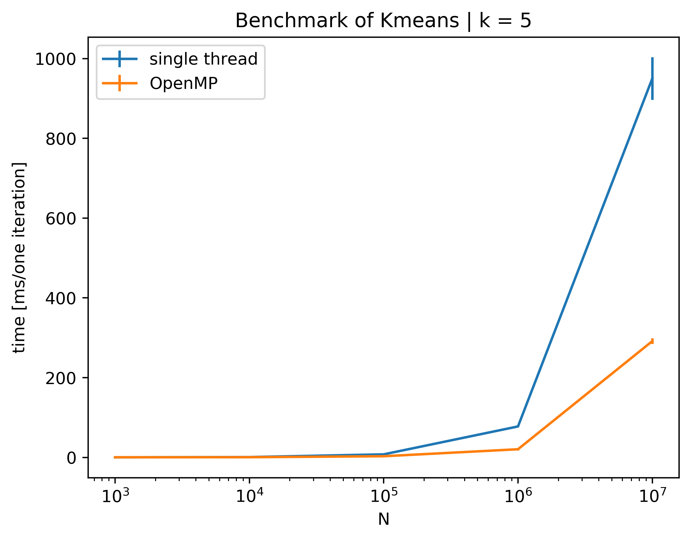

### Implementation of k-means algorithm using MPI

**Based on following paper**

    Zhang, Jing & Wu, Gongqing & Xuegang, Hu & Li, Shiying & Hao, Shuilong. (2011).
    A Parallel K-Means Clustering Algorithm with MPI. 10.1109/PAAP.2011.17.

|  |
| :-----------------------------------------------------------: |
|  **Results for: `Intel(R) Core(TM) i7-8565U CPU @ 1.80GHz`**  |

